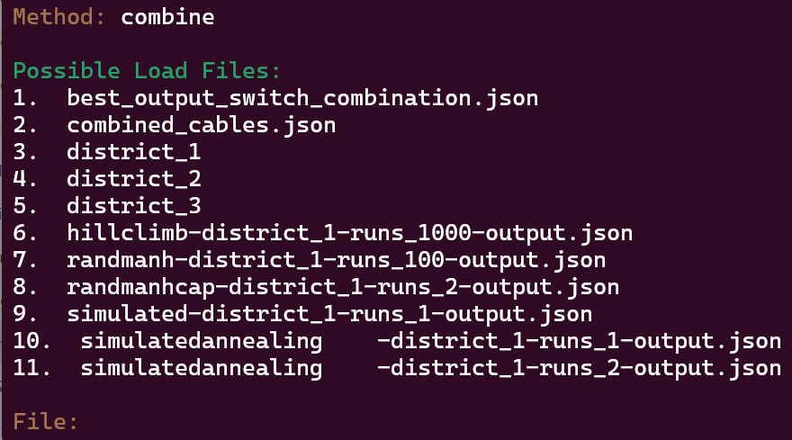

# Smart-and-Grit
Nowadays, lots of houses contribute to their own energy consumption via solar panels or other installations. More often than not, these installations produce more energy than needed for own cosumption. However, the current infrastructure does not hold into account these surplusses. In able to store these surplusses, batteries need to be placed along the grid.\
The goal is to find the best cable configuration for three given districts. Where the location of the batteries, the location of the houses and their outputs are given.\
In order to do this, there are a couple of requirements, namely:
- No battery can be connected to another battery, also not via a houses.
- No house can be connected to two batteries.
- There can be multiple cables along a grid segments. However, they are considered different cables. 
- At first, all houses must have their own cable to a battery (indicated by 'costs-own'). A shared cables configuration is indicated by 'costs-shared'.

## Objective Function
SmartGrid is a minimalisation problem. We need to minimalise the amount of cable segments we use. The amount of batteries is given. The costs of one piece are as following:
- Battery (B): 5000
- Cable (C): 9

The Object Function of this problem can thus be stated:

    Z = B * 5000 + C * 9

# Usage

## Requirements

All code has been written in Python 3.10.12.

All needed requirements can be installed by running: 

        pip install -r requirements.txt
## Run
Running of: python3 main.py gives the following option screen:

Where typing help in the method option gives a description of the possible methods.

Typing 'combine' in the method option shows a list of output files. Selecting one of these
indices runs the combine_cables algorithm on said output file. This creates a 'costs-shared'
 configuration from the selected 'costs-own' configuration.
 

## Structure
Here the most imported directories are stated:
- /code: constains all code (.py files)
    - /algorithms: contains all algorithms
    - /helpers: contains all helpers
    - /modules: contains all classes
    - /visualisation: contains all code concerning the visualisations
- /experiments: contains all code for the experiments
    - /hillclimber: contains hillclimber experiment script
    - /simulatedannealing: contains simulatedannealing experiment script
    - /beamsearch: 
    - results_timed.md: contains the results of the timed experiment for all algorithms
- /results: contains all found results

## Experiment
In /experiments/, tuning experiments can be conducted by running the script functions in /simulatedannealing/, /beamsearch/ and /hillclimber/.

### Simulated Annealing
The file simulatedannealing_experiment contains multiple functions.\
Where in the function simulannealing_temp_comparison different temperatures are compared.
This comparison can then be visualized via either the function simulannealing_temp_comparison_mean_graph() or 
simulannealing_temp_comparison_lowest_graph. Where the mean cost and the lowest cost are compared respectively.

### Beam search
The file beamsearschscript.py contains a BeamSearchTuning class. 
After creating an instance of this class by specifying the district number, \
the amount of runs and the largest allowed beam. The run_tuning() method can be executed \
after which the results will be written to a csv and the best result will be stored as a .json file

### Timed experments

A timed experiment can be ran using:

`python3 time_scripts.py <method>`

where the method can be one of closest, beamsearch, hillclimber, simulated or depthfirst
In this script, the algortihm will be run continuously for 2700 seconds. The cost of each state will be written to a csv file in the /output/ folder and the amount of runs will be printed in the terminal window.

## Tests
To run tests, run the following code:

        python3 -m pytest code/<directory>

Specify the directory to be tested. The following directories contain tests:
- /code (always to be specified)
    - /algorithms
    - /helpers
    - /modules
    - /visualisation

# Authors
- Jonas Brenninkmeijer (JoBrenn)
- Kathy Molenaar (kathymolenaar)
- Jesper Vreugde (JesVre)
