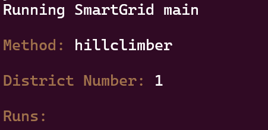

# Smart-and-Grit
Nowadays, lots of houses contribute to their own energy consumption via solar panels or other installations. More often than not, these installations produce more energy than needed for own cosumption. However, the current infrastructure does not hold into account these surplusses. In able to store these surplusses, batteries need to be placed along the grid.\
The goal is to find the best cable configuration for three given districts. Where the location of the batteries, the location of the houses and their outputs are given.\
In order to do this, there are a couple of requirements, namely:
- No battery can be connected to another battery, also not via a houses.
- No house can be connected to two batteries.
- There can be multiple cables along a grid segments. However, they are considered different cables. 
- At first, all houses must have their own cable to a battery.

# Usage

## Requirements
All code has been written in Python 3.10.12.\
All needed requirements can be installed by running: pip install -r requirements.txt
## Run
Running of: python3 main.py gives the following option screen:

Where typing help in the method option gives a description of the possible methods.

## Experiments

### Simulated annealing
The file simulatedannealing_experiment contains multiple functions.\
Where in the function simulannealing_temp_comparison different temperatures are compared.
This comparison can then be visualized via either the function simulannealing_temp_comparison_mean_graph() or 
simulannealing_temp_comparison_lowest_graph. Where the mean cost and the lowest cost are compared respectively.

## Structure
Here the most imported directories are stated:
- /code: constains all code (.py files)
    - /algorithms: contains all algorithms
    - /helpers: contains all helpers
    - /modules: contains all classes
    - /visualisation: contains all code concerning the visualisations
- /experiments: contains all code for the experiments
- /results: contains all found results

# Authors
- Jonas Brenninkmeijer
- Jesper Vreugde
- Kathy Molenaar